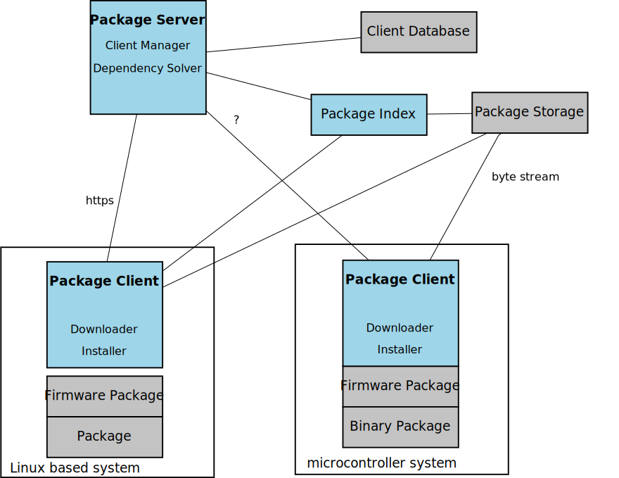

= ROSE Package Service
Josef Raschen <josef@raschen.org>
:toc:

[abstract]
--
The ROSE Package Service (RPS) implements a package based software deployment and update solutions for embedded systems. 

It consists of a server that manages the software on clients and provides software packages and a client that implmentens secure download and installation of software packages. Packages can either be file based archives or binary firmware. 

The client can run on an embedded Linux system or on a microcontroller where it support binary only packages. On Linux, file based archive packages can be deployed. 
--

== Versioning

RPS uses semantic versioning. See <<Data Structures>> for details. 

== Security

== Architecture Overview

.RPS Architecture

.Terminology
Package::
Deployment containter for software that consists of a descriptor, a cryptographic signnature and the package itself.
Package Repository::
Storage location for multiple packages. 
Package Server::
A service managing the softare deployment to clients. It keeps track of the packages on the clients and interacts with clients to change packages on them . It uses one or more package repositories. 
Package Client::
A software component running on clients for managing packages on the client. It interacts with the _Package Server_.

== Package

Each package has a descriptor that includes the following information:

Name::
A name that consist of characters A-Z, a-z, 0-9 and the special character "-" and identifies a package in a package repository. The name has to be unique in the package repository. 
Version::
A version descriptor consisting of the elements shown in <<PackageVersion>>. 

[#DevelopementStage]
.`DevelopementStage: enum`
[cols="1,1,3"]
|===
| Label | Value

| Release
| 0 

| ReleaseCandidate
| 2 

| Beta
| 3

| Alpha
| 4

| DevelomentSnapshot
| 5

|===

[#PackageVersion]
.`PackageVersion: struct`
[cols="1,2,4"]
|===
| Label     | Type                | Description

| `Major` 
| int16
| Minor version

| `Minor` 
| int16
| Minor version

| `Patch` 
| int16
| Minor version

| `DevelopmentStage` 
| `DevelopmentStage` 
| Only set for prerelease packages.

| `DevelopmentStageNumber` 
| int16 
| Only set for prerelease packages.

|===

.`PackageDescriptor: struct`
[cols="1,2,4"]
|===
| Label     | Type                | Description

| `ID` 
| uint8[16] 
| Unique ID of a package. Updated on each change of the package. 

| `Name` 
| string 
| Unique name of a package.

| `Version` 
| `PackageVersion` 
| Unique name of a package.

| `ReleaseDate`
| `Date`
| Date of the release of the current version

| `MaintainerName`
| string
| `Person, repsonsible for the package.`

| `MaintainerMail`
| string
| `E-mail address of the person, repsonsible for the package.`

| `DataHash`
| uint8[32]
| SHA3-256 sum of the package data
|===

.`Package`
[cols="1,2,4"]
|===
| Label     | Type                | Description

| `PackageDescriptor` 
| PackageDesriptor[] 
| Descriptor of the package, including hash of package data. 

| `Signature`
| ?
| Digital signature of the package. 

|===

The `ClientDescriptor` identify a client and define its state from package service perspective. 

.`ClientDescriptor`
[cols="1,2,4"]
|===
| Label      | Type      |Description
| `DeviceID` 
| uint128   
| Universally Unique Identifier (UUID) for the device

| `Vendor`   
| uint8[16] 
| Human readable device vendor descriptor, for informational purposes only

| `Product`  
| uint8[16] 
| Human readable device vendor, for informational purposes only
|===

.`ClientState`
[cols="1,2,4"]
|===
| Label     | Type                | Description

| `Packages` 
| PackageIdentifier[] 
| List of packages installed on the client (Linux clients only)

| `Branch`   
| string              
| Release branch currently in use 
|===

.`Message`
[cols="1,1,3"]
|===
| Label | Value | Description

| DeviceStatusReport 
| 1 
| Devices reports state to server. 

| DeviceStatusReport
| 2 
| Server responses with updates available for devices. 

|===

== Protocol

The communciation between server and clients uses either json based messages for Linux clients or in binary form for microcontroller clients. The sequences are idendical, the binary protocol uses an additional translation on the server to translate between json objects and binary massages. In case of the binary protocol, the server tracks the state of the clients which simplifies the messages and reduces the amount of informaton to be transferred. Especcially there is no list of installed packages reported.  

.Device Status
----
source: client
message: DeviceStatus
payload: ClientState

source: server
message: DeviceStatusResponse
payload: UpdateInformation
----

.Package Update
----
source: client
message: UpdateRequest
payload: Package
----

== Binary Protocol

=== Data Structures

=== Messages

Each message has a fixed size of 8 byte on transport layer. Multiple transport layer frames are bundled to transfer information larger than 8 bytes. 

.Frame
----
uint8 Type
uint8[7] MessageTypePayload
----

.DeviceStatus (Binary)
----
uint16 FirmwareVersion

----

